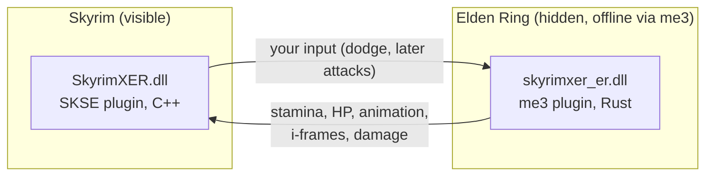

# Skyring: Skyrim × Elden Ring

**Play Skyrim with Elden Ring's combat.** You explore Skyrim's world, quests and NPCs, but your character fights by Elden Ring's rules:
stamina, dodge rolls with i-frames, poise, light/heavy/charged attacks, weapon arts, flasks and runes.


-yellow)


> **Pre-alpha. Not playable yet.** Both games run together and talk to each other every frame. Today, pressing Sprint in Skyrim makes
> the hidden Elden Ring character dodge, and Elden Ring's stamina comes back into Skyrim. Turning that into real combat in Skyrim is next.
> Live progress: [`STATUS.md`](STATUS.md) · Plan: [`docs/ROADMAP.md`](docs/ROADMAP.md) · Change log: [`MODLOG.md`](MODLOG.md)

<!-- Screenshot / GIF goes here once the first roll works in Skyrim. -->

## About this project

Skyrim and Elden Ring are my two favourite games. I saw the recent trend of people merging games
(like [SkyCraft](https://github.com/chasmlol/SkyCraft), which runs Minecraft inside Skyrim) and wanted to try it with the two games I love most.

I've been using AI for a while, and **this is my first attempt at merging games**. I build it with Claude Code in my own way of working,
which may be different from how other people use their AI. So **expect bugs**, rough edges and things that change a lot between versions.

Feedback, bug reports and ideas are welcome. You can find me on Discord: **bennetteu**.

## Made with Claude

This mod is built with **Claude Opus 5.5** in Claude Code, guided by a `CLAUDE.md` written for this project (rules, safety limits,
build and test commands, and how to run both games for playtests).
**Want Claude to work on this project the same way? [Get the project's CLAUDE.md](docs/ai/CLAUDE.md)**, copy it to the repository root
as `CLAUDE.md`, and start Claude Code in the repo.

## How it works

Neither game is rewritten. Both run at the same time: **Skyrim is the visible host**, and **Elden Ring runs hidden in the background**
as a combat engine. A native plugin in each game sends state back and forth through shared memory every frame (the "passthrough"
design pioneered by [SkyCraft](https://github.com/chasmlol/SkyCraft)).



| Skyrim owns | Elden Ring owns |
|---|---|
| World, collision, NPC AI, quests, dialogue, player movement | Stamina/FP/HP math, attack and roll timing, i-frames, poise, damage formulas, flasks, runes |

Details: [`docs/DESIGN.md`](docs/DESIGN.md).

## What works today

- Elden Ring runs **hidden** at a full 60 fps while you play Skyrim (it keeps running when its window isn't focused).
- **Sprint in Skyrim (Left Shift) → the Elden Ring character dodges.** Hold a movement key (W/A/S/D) while you tap Sprint and it **rolls**
  in that direction; tap Sprint alone and it backsteps. Elden Ring's own rules decide what happens (tap = dodge, hold = dash).
  While the link is active, Skyrim's own sprint is off (Sprint is the dodge now). **F10** turns the link off and on (off = plain Skyrim).
- **Elden Ring's state comes back to Skyrim every frame:** stamina (a dodge costs stamina in combat), HP, animation.
  Skyrim shows a short on-screen message after each dodge, e.g. `ER dodge: anim 27110 | stamina 136->124 | i-frames yes`.
- **Rolls cost stamina only while your Skyrim character is in combat**, like in Elden Ring (exploring, they're free).
- **Your Skyrim character moves with the roll:** the same distance as Elden Ring's roll, in the direction you're looking + holding,
  stopped by walls. Spamming chains rolls. **Tap** Sprint to dodge, **hold** it to sprint.
- **Roll i-frames reach Skyrim:** Skyrim knows the exact window (about 0.45 s) in which the Elden Ring roll makes you invincible.
- Fail-safe: if either game closes, crashes or pauses, the other one notices within a moment and stops acting on stale input.

**Not working yet:** there's no roll animation in Skyrim yet (your character slides), and fighting is still vanilla (P5). **Controller support isn't added yet:**
Skyrim is keyboard-and-mouse only for now (details below). The i-frames are known to Skyrim but don't protect your Skyrim character yet (P4).

## Progress

| Phase | Goal | State |
|---|---|---|
| P0 | Tooling and version research | ✅ done |
| P1 | Both plugins load and log | ✅ done |
| P2 | Shared memory link: handshake, heartbeats, crash fail-safe | ✅ done |
| P3 | Dodge in Skyrim → Elden Ring dodges → its stamina and i-frames come back | ✅ done |
| **P4** | **Rolls, i-frames, stamina and sprint drive the Skyrim player; controller support** | 🔄 in progress (3/7: Sprint = dodge, F10 toggle, combat stamina, rolls move you) |
| P5 | Damage both ways uses Elden Ring's math (poise, stagger) | ⏳ |
| P6 | Elden Ring-style HUD | ⏳ |
| P7 | Runes from kills, leveling, flasks refill at "graces" | ⏳ |
| P8 | Visual polish and performance | ⏳ |

Where this could go after that (Shouts as weapon arts, Standing Stones as Sites of Grace, dragon boss fights with posture breaks, ...):
see **"Beyond the roadmap"** in [`docs/ROADMAP.md`](docs/ROADMAP.md#beyond-the-roadmap-ideas).

## Tested setup

All development and testing happens on this exact setup. Other versions aren't supported yet.

| | Version |
|---|---|
| **Input** | **Keyboard and mouse** in both games for now. Skyrim: Sprint (Left Shift) = dodge, F10 = link on/off. |
| Skyrim Special/Anniversary Edition (Steam) | `SkyrimSE.exe` **1.7.104.0** |
| SKSE64 | **2.3.1** |
| Address Library for SKSE Plugins | **v13** (All in One) |
| Elden Ring + Shadow of the Erdtree (Steam) | patch **1.17.1** (`eldenring.exe` 2.7.1.0) |
| me3 (Elden Ring mod loader) | **0.13.0** |
| OS | Windows 11 x64 |

**Controller support: planned, not added yet.** The goal is a PS5 DualSense (wired). Elden Ring supports it natively, but Skyrim only
understands Xbox-style (XInput) controllers and gets a PlayStation pad only through Steam Input. Steam Input doesn't apply when SKSE starts
Skyrim outside Steam, which is how this project launches it. Solving that is part of P4.

You need your own legal copies of both games. This repository contains **no game files**.

## Safety

- **Offline only.** Modded Elden Ring is launched only through me3, which starts the game without Easy Anti-Cheat and blocks matchmaking.
  Never use this mod with Elden Ring's online features.
- **Your saves are separate.** Elden Ring uses a dedicated save file (`skyrimxer.sl2`). Your normal `ER0000.sl2` is never touched.
- **Automatic backups.** Every launch through the tools backs up both games' saves first.

## Installation

Not yet: there's nothing playable to install. A one-step installer with version checks is planned once P4 is playable.
Developers can build from source below.

## Building and the dev loop

Requires Visual Studio 2026 with C++ (its bundled CMake and vcpkg are used), Rust (stable, MSVC) and Git.

```powershell
git clone --recursive https://github.com/BennettCode/Skyring.git
cd Skyring
mkdir local; copy config\paths.example.json local\paths.json   # then edit the paths for your machine
powershell -ExecutionPolicy Bypass -File tools\setup-check.ps1   # checks versions and tools
```

Everything else is one command:

| Task | Command |
|---|---|
| Build + deploy + back up saves + launch both games + wait for both plugins | `tools\dev.ps1` |
| Same, with the Elden Ring window visible (to watch it react) | `tools\dev.ps1 -ErVisible` |
| Only the Elden Ring side, restarting it, and wait for you to load in (prints the results) | `tools\dev.ps1 -Target er -Game eldenring -Restart -WaitInWorld 20` |
| Build + deploy only | `tools\dev.ps1 -NoLaunch` |
| Close the games | `tools\stop-games.ps1` |
| Protocol + link tests (no game needed, ~25 s) | `tests\run-tests.ps1` |
| Regenerate the protocol after editing `protocol/schema/messages.toml` | `cargo run -p protogen` |
| Check Address Library ids before using them | `tools\addrlib-check.ps1 -Id 208040` |

Run scripts with `powershell -ExecutionPolicy Bypass -File <script>`. More in [`tools/README.md`](tools/README.md).

## Repository layout

| Path | What |
|---|---|
| `skse/` | Skyrim plugin (C++23, CommonLibSSE-NG) |
| `er-plugin/` | Elden Ring plugin (Rust, eldenring-rs) |
| `protocol/` | Shared-memory protocol: one TOML schema → generated C++ header + Rust module |
| `tools/` | PowerShell dev scripts, protocol generator, fake game peers for testing |
| `docs/` | Design, roadmap, research notes (plain-language reverse-engineering notes; no game code) |
| `docs/ai/` | The `CLAUDE.md` this project is built with (copy it to the repo root to use it) |

## Credits

Built on SKSE, CommonLibSSE-NG, Address Library, me3 and eldenring-rs, with the passthrough design from SkyCraft.
Full list and licenses: [`THIRD-PARTY-NOTICES.md`](THIRD-PARTY-NOTICES.md).

## Legal

Unofficial fan project. Not affiliated with or endorsed by Bethesda Softworks, ZeniMax, FromSoftware or Bandai Namco.
Offline/single-player only. Built with AI coding tools (Claude Code, Claude Opus 5.5).
License: **GPL-3.0-or-later** (see [`LICENSE`](LICENSE)). The Skyrim plugin links CommonLibSSE-NG, which is GPL-3.0-or-later.
