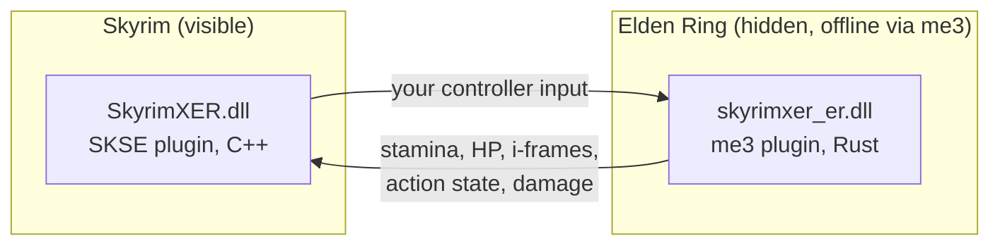

# Skyring: Skyrim × Elden Ring

**Play Skyrim with Elden Ring's combat.** You explore Skyrim's world, quests and NPCs, but your character fights by Elden Ring's rules:
stamina, dodge rolls with i-frames, poise, light/heavy/charged attacks, weapon arts, flasks and runes.


> **Pre-alpha. Not playable yet.** The two games already run together and talk to each other; combat is being wired up now.
> Live progress: [`STATUS.md`](STATUS.md) · Plan: [`docs/ROADMAP.md`](docs/ROADMAP.md) · Change log: [`MODLOG.md`](MODLOG.md)

<!-- Screenshot / GIF goes here once the first roll works in Skyrim. -->

## How it works

Neither game is rewritten. Both run at the same time: **Skyrim is the visible host**, and **Elden Ring runs hidden in the background**
as a combat engine. A native plugin in each game sends state back and forth through shared memory every frame (the "passthrough"
design pioneered by [SkyCraft](https://github.com/chasmlol/SkyCraft)).



| Skyrim owns | Elden Ring owns |
|---|---|
| World, collision, NPC AI, quests, dialogue, player movement | Stamina/FP/HP math, attack and roll timing, i-frames, poise, damage formulas, flasks, runes |

Details: [`docs/DESIGN.md`](docs/DESIGN.md).

## Progress

| Phase | Goal | State |
|---|---|---|
| P0 | Tooling and version research | ✅ done |
| P1 | Both plugins load and log | ✅ done |
| P2 | Shared memory link: handshake, heartbeats, crash fail-safe | ✅ done |
| **P3** | **Controller dodge in Skyrim → Elden Ring rolls → stamina comes back** | 🔄 in progress: ER runs hidden at 60 fps ✅, injected backstep (hidden) ✅, protocol v2 state slots ✅, Skyrim Sprint → ER backstep → state back ✅, stamina/i-frame readout 🔧 |
| P4 | Rolls, i-frames, stamina and sprint drive the Skyrim player | ⏳ |
| P5 | Damage both ways uses Elden Ring's math (poise, stagger) | ⏳ |
| P6 | Elden Ring-style HUD | ⏳ |
| P7 | Runes from kills, leveling, flasks refill at "graces" | ⏳ |
| P8 | Visual polish and performance | ⏳ |

## Tested setup

All development and playtesting happens on this exact setup. Other versions are not supported yet.

| | Version |
|---|---|
| **Controller** | **PlayStation 5 DualSense, wired (USB).** All gameplay is tested with it, in both games. Keyboard/mouse is not a test target. |
| Skyrim Special/Anniversary Edition (Steam) | `SkyrimSE.exe` **1.7.104.0** |
| SKSE64 | **2.3.1** |
| Address Library for SKSE Plugins | **v13** (All in One) |
| Elden Ring + Shadow of the Erdtree (Steam) | patch **1.17.1** (`eldenring.exe` 2.7.1.0) |
| me3 (Elden Ring mod loader) | **0.13.0** |
| OS | Windows 11 x64 |

**Controller notes:** Elden Ring supports the DualSense natively. Skyrim only speaks XInput, so it sees the DualSense through Steam Input,
which doesn't apply when SKSE is started outside Steam. Until that's solved, Skyrim is tested with the keyboard (Sprint = Left Shift).

You need your own legal copies of both games. This repository contains **no game files**.

## Safety

- **Offline only.** Modded Elden Ring is launched only through me3, which starts the game without Easy Anti-Cheat and blocks matchmaking.
  Never use this mod with Elden Ring's online features.
- **Your saves are separate.** Elden Ring uses a dedicated save file (`skyrimxer.sl2`). Your normal `ER0000.sl2` is never touched.
- **Automatic backups.** Every launch through the tools backs up both games' saves first.

## Installation

Not yet: there's nothing playable to install. Developers can build from source below.

## Building and the dev loop

Requires Visual Studio 2026 with C++ (its bundled CMake and vcpkg are used), Rust (stable, MSVC) and Git.

```powershell
git clone --recursive https://github.com/BennettCode/Skyring.git
cd Skyring
mkdir local; copy config\paths.example.json local\paths.json   # then edit the paths for your machine
powershell -ExecutionPolicy Bypass -File tools\setup-check.ps1   # checks versions and tools
```

Everything else is one command:

| Task | Command |
|---|---|
| Build + deploy + back up saves + launch both games + wait for both plugins | `tools\dev.ps1` |
| Only the Elden Ring side, restarting it, and wait for you to load in (prints the results) | `tools\dev.ps1 -Target er -Game eldenring -Restart -WaitInWorld 20` |
| Build + deploy only | `tools\dev.ps1 -NoLaunch` |
| Close the games | `tools\stop-games.ps1` |
| Protocol + link tests (no game needed, ~20 s) | `tests\run-tests.ps1` |
| Regenerate the protocol after editing `protocol/schema/messages.toml` | `cargo run -p protogen` |

Run scripts with `powershell -ExecutionPolicy Bypass -File <script>`. More in [`tools/README.md`](tools/README.md).

## Repository layout

| Path | What |
|---|---|
| `skse/` | Skyrim plugin (C++23, CommonLibSSE-NG) |
| `er-plugin/` | Elden Ring plugin (Rust, eldenring-rs) |
| `protocol/` | Shared-memory protocol: one TOML schema → generated C++ header + Rust module |
| `tools/` | PowerShell dev scripts, protocol generator, fake game peers for testing |
| `docs/` | Design, roadmap, research notes (plain-language reverse-engineering notes; no game code) |

## Credits

Built on SKSE, CommonLibSSE-NG, Address Library, me3 and eldenring-rs, with the passthrough design from SkyCraft.
Full list and licenses: [`THIRD-PARTY-NOTICES.md`](THIRD-PARTY-NOTICES.md).

## Legal

Unofficial fan project. Not affiliated with or endorsed by Bethesda Softworks, ZeniMax, FromSoftware or Bandai Namco.
Offline/single-player only. Built with AI coding tools (Claude Code).
License: **GPL-3.0-or-later** (see [`LICENSE`](LICENSE)). The Skyrim plugin links CommonLibSSE-NG, which is GPL-3.0-or-later.
