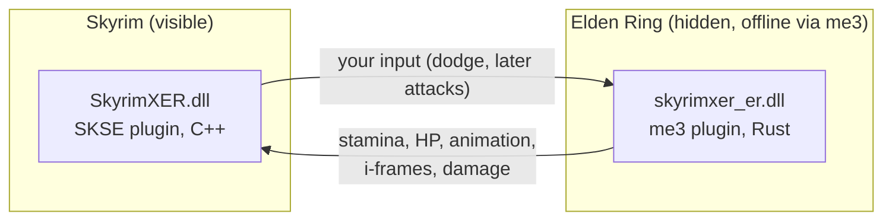

# Skyring: Skyrim × Elden Ring

**Play Skyrim with Elden Ring's combat.** You explore Skyrim's world, quests and NPCs, but your character fights by Elden Ring's rules:
stamina, dodge rolls with i-frames, poise, light/heavy/charged attacks, weapon arts, flasks and runes.


> **Pre-alpha. Not playable yet.** Both games run together and talk to each other every frame. Today, pressing Sprint in Skyrim makes
> the hidden Elden Ring character dodge, Elden Ring's stamina comes back into Skyrim, and rolling through an enemy's swing makes it miss.
> Turning that into real combat in Skyrim is next.
> Live progress: [`STATUS.md`](STATUS.md) · Plan: [`docs/ROADMAP.md`](docs/ROADMAP.md) · Change log: [`MODLOG.md`](MODLOG.md)

<!-- Screenshot / GIF goes here once the first roll works in Skyrim. -->

## About this project

Skyrim and Elden Ring are my two favourite games. I saw the recent trend of people merging games
(like [SkyCraft](https://github.com/chasmlol/SkyCraft), which runs Minecraft inside Skyrim) and wanted to try it with the two games I love most.

I've been using AI for a while, and **this is my first attempt at merging games**. I build it with Claude Code in my own way of working,
which may be different from how other people use their AI. So **expect bugs**, rough edges and things that change a lot between versions.

Feedback, bug reports and ideas are welcome. You can find me on Discord: **bennetteu**.

## Made with Claude

This mod is built with **Claude Opus 5.5** in Claude Code, guided by a `CLAUDE.md` written for this project (rules, safety limits,
build and test commands, and how to run both games for playtests).
**Want Claude to work on this project the same way? [Get the project's CLAUDE.md](docs/ai/CLAUDE.md)**, copy it to the repository root
as `CLAUDE.md`, and start Claude Code in the repo.

## How it works

Neither game is rewritten. Both run at the same time: **Skyrim is the visible host**, and **Elden Ring runs hidden in the background**
as a combat engine. A native plugin in each game sends state back and forth through shared memory every frame (the "passthrough"
design pioneered by [SkyCraft](https://github.com/chasmlol/SkyCraft)).



| Skyrim owns | Elden Ring owns |
|---|---|
| World, collision, NPC AI, quests, dialogue, player movement | Stamina/FP/HP math, attack and roll timing, i-frames, poise, damage formulas, flasks, runes |

Details: [`docs/DESIGN.md`](docs/DESIGN.md).

## What works today

- Elden Ring runs **hidden** at a full 60 fps while you play Skyrim (it keeps running when its window isn't focused).
- **You move like an Elden Ring character.** While the link is on, W/A/S/D walk and run with Elden Ring's own animations and
  speeds, turning toward where you look and press, on Skyrim's ground and walls. **Left Shift: tap = roll, hold = sprint** (Elden Ring's
  sprint, which costs stamina in combat). A roll flows straight back into the run. Turning the camera doesn't turn your character.
  **Caps Lock** (Skyrim's walk toggle) walks. Jumping, swimming, sneaking, riding, sitting and getting knocked down are plain Skyrim, and
  your character goes back to Elden Ring's movement as soon as they end. Attacking, blocking, casting and drawing a weapon also use
  Skyrim's own animations for now (Left Shift still rolls then).
- **PS5 DualSense with Elden Ring's buttons** (USB or Bluetooth, read by the mod itself, no Steam Input or DS4Windows needed). While the
  link is on: **R1** attack, **R2** heavy attack (hold to charge), **L1** guard, **L2** weapon art: these are Elden Ring's moves, played on
  your Skyrim character. **Circle** tap = roll, hold = sprint. Skyrim keeps what Elden Ring has no use for: **Cross** jump, **Triangle**
  talk/loot/open, **Square** draw/sheathe, **L3** sneak, **R3** camera view, **Options** Tween menu, **Touchpad** map, **Create** Journal
  (pause menu), **d-pad up** shout, **d-pad down** favorites, **d-pad left/right** hotkeys. In menus the pad works like an Xbox pad
  (Circle = back, L1/R1 or L2/R2 switch Journal tabs). On the mouse: left click = Elden Ring attack, right click = guard.
  A press with your weapon sheathed draws it first. An Xbox controller gets the same layout.
- **Your Elden Ring swings hit Skyrim enemies.** When the Elden Ring swing reaches its hit frames, whoever is in reach in front of you
  takes Elden Ring's damage: your Elden Ring weapon's real attack rating (its upgrade level and your Elden Ring stats count), Elden Ring's
  defense formula against the enemy's level and armour, scaled to Skyrim health so enemies take about as many hits as a comparable Elden
  Ring enemy. Heavy hits build poise damage that staggers. Skyrim plays the blood, hit reaction, crime and kill like any hit.
  `SkyrimXER.ini` → `[Combat] fDamageScale` tunes it (Skyrim's difficulty setting still multiplies your damage too).
- **Sprint in Skyrim (Left Shift) → the Elden Ring character dodges.** Hold a movement key (W/A/S/D) while you tap Sprint and it **rolls**
  in that direction; tap Sprint alone and it backsteps. Elden Ring's own rules decide what happens.
  While the link is active, Skyrim's own sprint is off. **F10** turns the link off and on (off = plain Skyrim).
- **Elden Ring's state comes back to Skyrim every frame:** stamina (a dodge costs stamina in combat), HP, animation.
  Skyrim shows a short on-screen message after each dodge, e.g. `ER dodge: anim 27110 | stamina 136->124 | i-frames yes`.
- **Rolls cost stamina only while your Skyrim character is in combat**, like in Elden Ring (exploring, they're free).
- **Skyrim's stamina bar is Elden Ring's stamina.** It drains when you roll or sprint in combat and refills at Elden Ring's pace;
  when it's empty, Elden Ring decides you can't roll. F10 (link off) gives Skyrim its own stamina back.
- **Your Skyrim character moves with the roll,** smoothly every frame: the same distance and speed as Elden Ring's roll, in the direction you're looking + holding,
  stopped by Skyrim's walls (Elden Ring's walls don't matter: the hidden character never leaves its spot). Spamming chains rolls. **Tap** Sprint to dodge, **hold** it to sprint.
- **Your Skyrim character plays Elden Ring's real roll animation.** Elden Ring plays the roll on its hidden character, and its skeleton
  pose (spine, head, arms, legs) is copied onto your Skyrim character every frame, facing the way you roll. No animation files are
  converted or shipped. The body blends in and out over a few frames. The same goes for walking, running and sprinting.
- **Roll i-frames protect you in Skyrim:** during the window (about 0.45 s) in which the Elden Ring roll makes you invincible, enemy
  melee hits on your Skyrim character are cancelled whole (no damage, no stagger). Hits outside that window land as usual.
  Arrows and spells still hit you during a roll (next phase).
- Fail-safe: if either game closes, crashes or pauses, the other one notices within a moment and stops acting on stale input.

**Not working yet:** fighting is still vanilla (P5). Footstep sounds may be missing while Elden Ring moves you, and Skyrim's
NPCs still see your character facing the way it last faced in Skyrim (only the body you see turns); a jump can briefly flip the body
to that old facing. Elden Ring's character holds its weapon the way yours does (fists when you're unarmed
or sheathed, one- or two-handed when you draw a weapon), but it doesn't use the same *kind* of weapon yet. The roll animation copies the main bones (fingers and toes follow their hands and feet); cloth and armour
helpers follow Skyrim's own pose, and feet can slide a little (no foot placement yet). **Which Skyrim weapon you hold doesn't pick
the Elden Ring weapon yet:** Elden Ring swings its own equipped weapon (one-handed or two-handed like yours). Enemy hits on you still use
Skyrim's health and armour.
While the link is on, Skyrim spells, bows and shield bashes aren't on any button (F10 gives them back), and Skyrim's Wait has no pad
button (keyboard T works). Arrows and spells still hit you during a roll.

## Progress

| Phase | Goal | State |
|---|---|---|
| P0 | Tooling and version research | ✅ done |
| P1 | Both plugins load and log | ✅ done |
| P2 | Shared memory link: handshake, heartbeats, crash fail-safe | ✅ done |
| P3 | Dodge in Skyrim → Elden Ring dodges → its stamina and i-frames come back | ✅ done |
| **P4** | **Rolls, i-frames, stamina and sprint drive the Skyrim player; controller support** | 🔄 in progress (8/8 built, final playtest pending: Sprint = dodge, combat stamina, rolls move you, Elden Ring's roll animation plays in Skyrim; walking, running and sprinting are Elden Ring's; Skyrim's stamina bar shows Elden Ring's; roll i-frames make melee hits miss; DualSense with Elden Ring's buttons) |
| **P5** | **Damage both ways uses Elden Ring's math (poise, stagger)** | 🔄 in progress (your Elden Ring swings hit Skyrim enemies with Elden Ring damage and poise) |
| P6 | Elden Ring-style HUD | ⏳ |
| P7 | Runes from kills, leveling, flasks refill at "graces" | ⏳ |
| P8 | Visual polish and performance | ⏳ |

Where this could go after that (Shouts as weapon arts, Standing Stones as Sites of Grace, dragon boss fights with posture breaks, ...):
see **"Beyond the roadmap"** in [`docs/ROADMAP.md`](docs/ROADMAP.md#beyond-the-roadmap-ideas).

## Tested setup

All development and testing happens on this exact setup. Other versions aren't supported yet.

| | Version |
|---|---|
| **Input** | **PS5 DualSense over USB** (Elden Ring's layout, see above) or **keyboard and mouse**. Skyrim keyboard: Sprint (Left Shift) = dodge, F10 = link on/off. |
| Skyrim Special/Anniversary Edition (Steam) | `SkyrimSE.exe` **1.7.104.0** |
| SKSE64 | **2.3.1** |
| Address Library for SKSE Plugins | **v13** (All in One) |
| Elden Ring + Shadow of the Erdtree (Steam) | patch **1.17.1** (`eldenring.exe` 2.7.1.0) |
| me3 (Elden Ring mod loader) | **0.13.0** |
| OS | Windows 11 x64 |

**Controller:** Skyrim only understands Xbox-style (XInput) controllers, and Steam Input doesn't apply when SKSE starts Skyrim outside
Steam. So the mod reads the DualSense itself and hands Skyrim an Xbox pad with the layout above. While the link is on, Skyrim is the
only game that listens to the pad: Elden Ring gets just the moves Skyrim sends it. Tested wired (USB); Bluetooth is supported but untested.

You need your own legal copies of both games. This repository contains **no game files**.

## Safety

- **Offline only.** Modded Elden Ring is launched only through me3, which starts the game without Easy Anti-Cheat and blocks matchmaking.
  Never use this mod with Elden Ring's online features.
- **Your saves are separate.** Elden Ring uses a dedicated save file (`skyrimxer.sl2`). Your normal `ER0000.sl2` is never touched.
- **Automatic backups.** Every launch through the tools backs up both games' saves first.

## Installation

Not yet: there's nothing playable to install. A one-step installer with version checks is planned once P4 is playable.
Developers can build from source below.

## Building and the dev loop

Requires Visual Studio 2026 with C++ (its bundled CMake and vcpkg are used), Rust (stable, MSVC) and Git.

```powershell
git clone --recursive https://github.com/BennettCode/Skyring.git
cd Skyring
mkdir local; copy config\paths.example.json local\paths.json   # then edit the paths for your machine
powershell -ExecutionPolicy Bypass -File tools\setup-check.ps1   # checks versions and tools
```

Everything else is one command:

| Task | Command |
|---|---|
| Build + deploy + back up saves + launch both games + wait for both plugins | `tools\dev.ps1` |
| Same, with the Elden Ring window visible (to watch it react) | `tools\dev.ps1 -ErVisible` |
| Only the Elden Ring side, restarting it, and wait for you to load in (prints the results) | `tools\dev.ps1 -Target er -Game eldenring -Restart -WaitInWorld 20` |
| Build + deploy only | `tools\dev.ps1 -NoLaunch` |
| Close the games | `tools\stop-games.ps1` |
| Protocol + link tests (no game needed, ~25 s) | `tests\run-tests.ps1` |
| Regenerate the protocol after editing `protocol/schema/messages.toml` | `cargo run -p protogen` |
| Check Address Library ids before using them | `tools\addrlib-check.ps1 -Id 208040` |

Run scripts with `powershell -ExecutionPolicy Bypass -File <script>`. More in [`tools/README.md`](tools/README.md).

## Repository layout

| Path | What |
|---|---|
| `skse/` | Skyrim plugin (C++23, CommonLibSSE-NG) |
| `er-plugin/` | Elden Ring plugin (Rust, eldenring-rs) |
| `protocol/` | Shared-memory protocol: one TOML schema → generated C++ header + Rust module |
| `tools/` | PowerShell dev scripts, protocol generator, fake game peers for testing |
| `docs/` | Design, roadmap, research notes (plain-language reverse-engineering notes; no game code) |
| `docs/ai/` | The `CLAUDE.md` this project is built with (copy it to the repo root to use it) |

## Credits

Built on SKSE, CommonLibSSE-NG, Address Library, me3 and eldenring-rs. Design and code patterns are borrowed (with thanks) from
other game-merge projects (SkyCraft's frame interpolation is adapted in `skse/src/bridge/Timeline.cpp` its hit call-site check in `skse/src/hooks/PlayerHit.cpp` and its hit apply in `skse/src/bridge/Combat.cpp`, FalloutCraft's bar mirror in `skse/src/bridge/Stamina.cpp`, both MIT): [SkyCraft](https://github.com/chasmlol/SkyCraft), [FalloutCraft](https://github.com/zeyvu/FalloutCraft),
[Killcraft](https://github.com/goonsn/Killcraft), [2010-rust-rewrite-mashup](https://github.com/chasmlol/2010-rust-rewrite-mashup)
and the ideas of [GTA San AnSkateas](https://github.com/ryglizzy/GTA-San-AnSkateas).
Full list and licenses: [`THIRD-PARTY-NOTICES.md`](THIRD-PARTY-NOTICES.md).

## Legal

Unofficial fan project. Not affiliated with or endorsed by Bethesda Softworks, ZeniMax, FromSoftware or Bandai Namco.
Offline/single-player only. Built with AI coding tools (Claude Code, Claude Opus 5.5).
License: **GPL-3.0-or-later** (see [`LICENSE`](LICENSE)). The Skyrim plugin links CommonLibSSE-NG, which is GPL-3.0-or-later.
